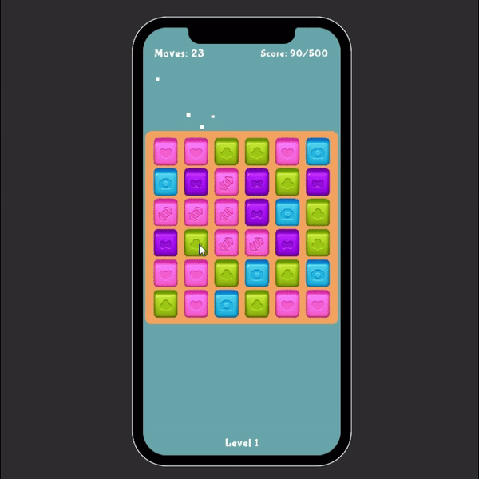

# Blast Mechanic Case Study

**Developed for:** Good Job Games Summer Internship Case  
**Engine:** Unity 2022.3 LTS  
**Language:** C#

## Intro

Hey! This is my attempt at building the core "Blast" mechanic for the case study. 

The UI is pretty basic, just Unity's built-in TextMeshPro and simple panels. I decided to spend most of my time on the code architecture and performance rather than making fancy visuals, since the case requirements emphasized the technical side.

I learned a ton working on this project, especially around memory management and grid based game systems!

## Technical Stuff I Implemented

### 1. Breadth-First Search for Flood Fill

For detecting connected blocks, I needed some kind of flood fill algorithm. After researching, I learned that recursive solutions (DFS) can cause stack overflow issues on larger grids, especially on mobile devices.

**What I Did:**
- I implemented BFS using a `Queue` instead of recursion.
- It's iterative, so it won't crash even on a 10×10 grid.
- I reuse the same `Queue` and `HashSet` across searches to avoid creating new collections every time.

I tested this with different grid sizes and it feels pretty solid. The BFS approach was new to me, but it made sense once I understood the stack overflow risk.

### 2. Object Pooling 

This was actually my first time implementing a proper object pool from scratch. I read that calling `Instantiate()` and `Destroy()` constantly causes garbage collection spikes, which kills performance on mobile.

**What I Did:**
- Created a `BlockPool` class that pre-allocates all the blocks at startup.
- During gameplay, blocks are just reactivated/deactivated instead of being destroyed.
- Applied the same pattern to particle effects in `VFXManager`.

### 3. Procedural Level System

Instead of hardcoding one grid size, I built a level progression system where the grid changes dynamically:

- **Level 1:** 6×6, 4 colors (easy intro)
- **Level 2:** 8×8, 5 colors (standard)
- **Level 3:** 9×7, 5 colors (narrow grid)
- **Level 4:** 9×9, 6 colors (maximum chaos)

After Level 4, it loops back to Level 1. I wanted to show that the system can handle different configurations without breaking. All the level data is stored in a serialized array, so you can tweak the progression in the Inspector.

### 4. Smart Shuffle for Deadlocks

When the player runs out of valid moves, the game needs to shuffle. But I needed to be careful about the rules for shuffling.

**My Approach:**
- Shuffle the block positions.
- Force at least one match by setting two adjacent blocks to the same color.
- Verify that a valid move exists before finishing.

### 5. DOTween for Animations

I used DOTween for all the movement and effects:
- Blocks scale up when spawning (bounce effect).
- Smooth falling animations with easing.
- Screen shake for big combos (>5 blocks).
- Win/Lose panel animations.

I made sure to `.Kill()` tweens before starting new ones to avoid memory leaks. DOTween was way easier than writing custom animation coroutines.

### 6. Responsive Camera System

The game needed to work on both iPhones and iPads. On iPads (4:3 aspect ratio), the board was clipping into the UI at the top.

**What I Did:**
- Built a `ResponsiveCameraController` that calculates the camera size based on the grid dimensions.
- Added "UI safe area" margins so the top HUD never overlaps.
- The camera auto-adjusts when switching between levels (6×6 → 9×9).

### 7. Input System

I used Unity's legacy Input Manager (`Input.GetMouseButtonDown`) instead of the new Input System. Honestly, I'm just more familiar with the old system, and with the deadline I wanted to focus on the core mechanics rather than learning a new input API. It works fine for mouse and touch, so I went with it.

## Features

**Core Gameplay:**
-  Configurable grid (rows, columns, colors)
-  Tap to destroy connected groups (2+ blocks)
-  Gravity system with animations
-  New blocks spawn from top
-  Deadlock detection + smart shuffle
-  Dynamic icons (blocks change based on group size)

**Game Loop:**
-  4 levels with procedural difficulty
-  Move counter and score tracking
-  Win/Lose conditions
-  Infinite loop (Level 4 → Level 1)

**Performance:**
-  Object pooling for blocks and particles
-  Zero allocations during gameplay (verified in Profiler)
-  BFS algorithm (safe for mobile)
-  DOTween memory management

**Polish:**
-  Juicy animations 
-  Screen shake for big matches
-  Invalid click feedback
-  Particle effects 
-  Audio with pitch randomization

**Bonus:**
-  Custom Inspector tool (validation + testing button)
-  Performance monitor (F1 to toggle FPS/memory)

## How to Test

1. Open `Assets/Scenes/MainScene.unity`
2. Hit **Play**
3. Click on groups of 2+ same-color blocks to destroy them
4. Try to reach the target score before running out of moves
5. Win Level 4 to see it loop back to Level 1

**Testing Tips:**
- Press **F1** to see FPS and memory usage
- Select **GameBoard** in Hierarchy to see validation warnings in Inspector
- Test on different devices using Device Simulator 

**Level Stats:**
- Level 1: 6×6, 4 colors, 500 target, 25 moves
- Level 2: 8×8, 5 colors, 1500 target, 30 moves
- Level 3: 9×7, 5 colors, 2000 target, 35 moves
- Level 4: 9×9, 6 colors, 3000 target, 40 moves

## Final Thoughts

This was my first time building a full match-3 style game from scratch, and I'm really happy with how it turned out!

I tried to focus on clean code and performance optimization since those were emphasized in the case requirements. I hope this shows that I'm excited to learn and can pick up new concepts quickly!
